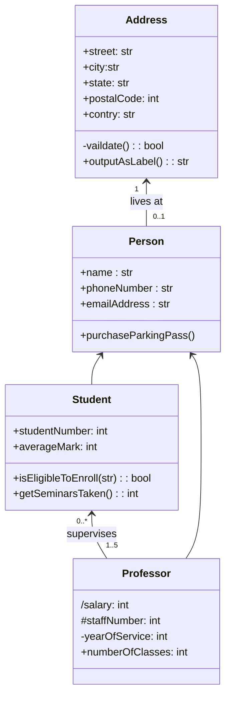
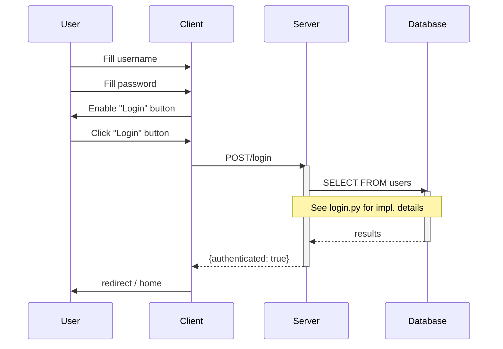

#  Mermaid 실습
- 순서도
    - 첫번째 샘플


<br><br><br><br><br><br><br><br><br><br><br><br><br><br><br><br><br>




<!-- ```mermaid
sequenceDiagram
    participant A as Data Updater
    participant B as DB
    loop 1시간마다 수행
        A ->> B: send update data
        B ->> A: update result
    end
``` -->
<!-- ```
flowchart 
    a([밥을 먹지 않았다])
    b{{String status = hunger  <br> String food = nothing}}
    c{배가 고픈가}
    d{먹을 것이 있는가?}
    e[밥을 먹는다]
    f[밥을 먹는다]
    g([end])
    aa[배불러]
    a -- b -- c --|yes| d --|yes| e -- f -- g
    h[안 먹는다.]
    i[먹지 않는다.]
    c --|no|aa -- h
    d --|no| h -- i--g
``` -->